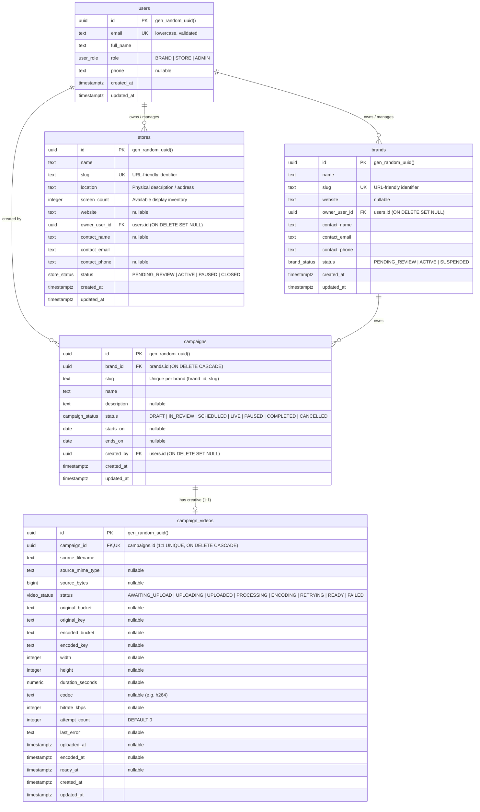

# Database Schema Documentation — String Theory

This document outlines the relational database schema for the **String Theory** advertising platform.

---

## 1. Entity-Relationship (ER) Diagram

---

## 2. Schema Architecture & Design Principles

- **PostgreSQL Core**: Uses `pgcrypto` (`gen_random_uuid()`) for non-enumerable primary keys and `timestamptz` across all tables.
- **Trigger-Driven `updated_at`**: Maintained automatically at the database level via the `st_set_updated_at()` trigger function.
- **Strict Database Invariants**: Extensive check constraints validate non-blank strings, lowercase emails, valid URL schemes, and logical date ranges (`ends_on >= starts_on`).
- **Referential Integrity**:
  - `brands.owner_user_id` / `stores.owner_user_id` / `campaigns.created_by`: Use `ON DELETE SET NULL` to preserve business and billing records if user accounts are removed.
  - `campaigns.brand_id` & `campaign_videos.campaign_id`: Use `ON DELETE CASCADE` to clean up associated campaign resources when a brand or campaign is deleted.

---

## 3. Tables & Enums Summary

| Table | Description | Primary Key | Foreign Keys / Relations |
| :--- | :--- | :--- | :--- |
| **`users`** | Authentication and RBAC identity (`BRAND`, `STORE`, `ADMIN`) | `id` (UUID) | None |
| **`brands`** | Brand customer accounts and business contacts | `id` (UUID) | `owner_user_id` &rarr; `users.id` |
| **`stores`** | Physical store display network venues and screen inventory | `id` (UUID) | `owner_user_id` &rarr; `users.id` |
| **`campaigns`** | Marketing campaigns scoped to brands with lifecycle states | `id` (UUID) | `brand_id` &rarr; `brands.id`, `created_by` &rarr; `users.id` |
| **`campaign_videos`** | 1:1 Creative video metadata, S3 keys, and transcoding pipeline states | `id` (UUID) | `campaign_id` &rarr; `campaigns.id` (1:1 UNIQUE) |

### Custom Enums:
- `user_role`: `'BRAND'`, `'STORE'`, `'ADMIN'`
- `brand_status`: `'PENDING_REVIEW'`, `'ACTIVE'`, `'SUSPENDED'`
- `store_status`: `'PENDING_REVIEW'`, `'ACTIVE'`, `'PAUSED'`, `'CLOSED'`
- `campaign_status`: `'DRAFT'`, `'IN_REVIEW'`, `'SCHEDULED'`, `'LIVE'`, `'PAUSED'`, `'COMPLETED'`, `'CANCELLED'`
- `video_status`: `'AWAITING_UPLOAD'`, `'UPLOADING'`, `'UPLOADED'`, `'PROCESSING'`, `'ENCODING'`, `'RETRYING'`, `'READY'`, `'FAILED'`
