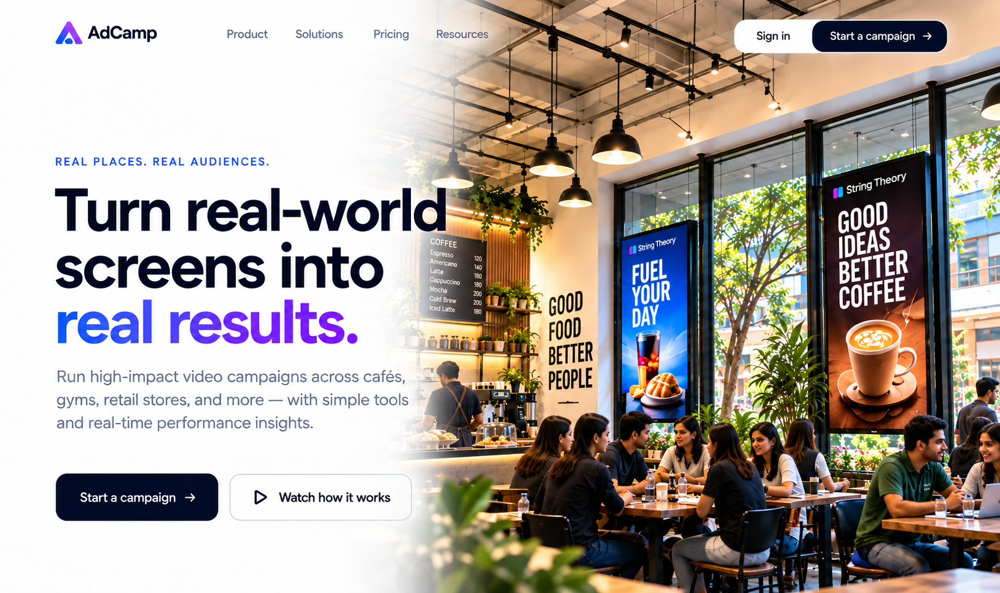

There are still some changes in the landing page.
1. design the landing page exactly as mentioned.
2. 
generate exactly how its present in the image
3. remove chapter names
4. remove chapter 1 text , remove (1 of 4 text)
5. chapter 1 images : occupy almost width of screen, increase size of each tile. 
6. Make it slow smooth transition as mouse wheel is scrolled. fix image "assets/clothes-tile.png" 
7. remove the word "chapter 2"
8. very shorten "Upload once and the platform handles the rest — preparing your creative for every screen in the network, placing it in each venue’s schedule, and reporting back as it runs."
9. chapter 3 : just one image on the right is fine (remove the second image)
In the left side, remove the small image, instead list top 3 places that match the category (Store name, Place, Expected crowd/people) keep all places bengaluru centric names
10. Remove "Brand → Target audience → Matching venues → Select venues → Advertise"
11. chapter 4 : find a better way to discuss about the platform instead of a grid.
